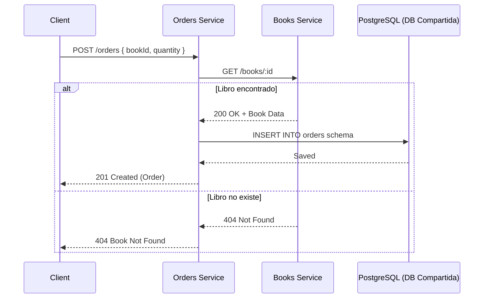

# 🏪 Bookstore Microservices API

Un sistema de microservicios simple para gestionar una librería, construido con **NestJS**, **Prisma** y **arquitectura Hexagonal + Clean + DDD**. Incluye dos servicios independientes:

- 📚 **Books Service** → Gestión de libros.
- 🛒 **Orders Service** → Gestión de órdenes, validando libros a través del servicio de Books vía HTTP.

---

## 📑 Tabla de Contenidos
- [📌 Descripción General](#-descripción-general)
- [🏗️ Arquitectura del Sistema](#️-arquitectura-del-sistema)
  - [Estructura de los microservicios] (#-estructura-de-los-microservicios)
  - [Diagramas Mermaid] (#-diagramas-mermaid)
- [🧰 Tecnologías](#-tecnologías)
- [⚙️ Requisitos Previos](#-requisitos-previos)
- [🚀 Instalación & Ejecución](#-instalación--ejecución)
  - [Docker Compose](#-docker-compose)
  - [Ejecución local](#-ejecución-local)
- [📦 Dependencias](#-dependencias)
- [📝 Endpoints Principales](#-endpoints-principales)
- [🛠️ Decisiones de Arquitectura](#-decisiones-de-arquitectura)
- [Autor](#-autor)
- [Licencia](#-licencia)

---

## 📌 Descripción General

Este sistema implementa dos microservicios independientes que se comunican vía **HTTP** siguiendo principios de **arquitectura de microservicios**:

- **Books Service** → permite crear, leer y buscar libros.
- **Orders Service** → permite crear y listar órdenes. Antes de crear una orden, valida la existencia del libro llamando al Books Service.

Cada servicio tiene **su propio schema en una base de datos compartida** y no acceden a los schemas de otros servicios.

---

## 🏗️ Arquitectura del Sistema

### 📂 Estructura de directorios

```
.
├── books-service/        # Microservicio de libros
├── orders-service/       # Microservicio de órdenes
├── docker-compose.yml    # Orquestación de servicios
└── README.md             # Documentación raíz
```

### 🌐 Diagrama de microservicios

```mermaid
flowchart LR
    subgraph Client[Cliente / Frontend]
      UI[UI / Swagger / cURL]
    end

    subgraph Books[📚 Books Service]
      BC[BookController]
      BU[UseCases]
      BR[BookRepository]
    end

    subgraph Orders[🛒 Orders Service]
      OC[OrderController]
      OU[UseCases]
      OR[OrderRepository]
    end

    subgraph DB[(PostgreSQL - Base de Datos Compartida)]
      DBS1[(Schema: books)]
      DBS2[(Schema: orders)]
    end

    UI -->|HTTP| BC
    UI -->|HTTP| OC

    OC -->|HTTP /books/:id| BC

    BR --> DBS1
    OR --> DBS2
```

### ⚙️ Flujo de creación de una orden



---

## ⚙️ Requisitos Previos

- Node.js v22
- Docker & Docker Compose
- PostgreSQL (opcional si no usas Docker)

---

## 🚀 Instalación & Ejecución

1. Clona el repositorio junto a sus submódulos y entra al directorio:

   ```bash
   git clone --recurse-submodules git@github.com:SebastianBC09/Bookstore-microservice-system.git
   cd Bookstore-microservice-system
   ```


### 🐳 Docker Compose

Levantar con:

```bash
docker-compose up --build
```

### 💻 Ejecución local (sin Docker)

1. Levantar cada servicio (`npm run start:dev` en cada carpeta).
2. Configurar `.env` en cada microservicio con `DATABASE_URL` y puertos.

---

## 📝 Endpoints Principales

### Books Service
- `GET /books`
- `GET /books/:id`
- `POST /books`

### Orders Service
- `GET /orders`
- `POST /orders`

---

## 🛠️ Decisiones de Arquitectura

- **Arquitectura Hexagonal**: separación clara entre `domain`, `application`, `infrastructure` e `interfaces`.
- **Comunicación HTTP**: los servicios se comunican vía REST, nunca a traves de la DB.
- **Errores de dominio**: clases específicas (`BookNotFoundError`, `BooksServiceUnavailableError`, etc.) mapeadas a códigos HTTP.
- **Prisma como infraestructura**: nunca se expone fuera de la capa infra.
- **Swagger en cada servicio**: documentación accesible en `/api`.

---

## 👨‍💻 Autor

**Sebastian Ballen C** - _FullStack Developer_

- LinkedIn: [Sebastian B.](https://www.linkedin.com/in/sebastianballencastaneda-softwaredeveloper)
- Email: sebastian.ballenc@gmail.com

---

## 📄 Licencia

Este proyecto está licenciado bajo la Licencia MIT - vea el archivo [LICENSE](LICENSE) para más detalles.

---

⭐️ **Si te resulta útil este proyecto, ¡no olvides darle una estrella en GitHub!** ⭐️
